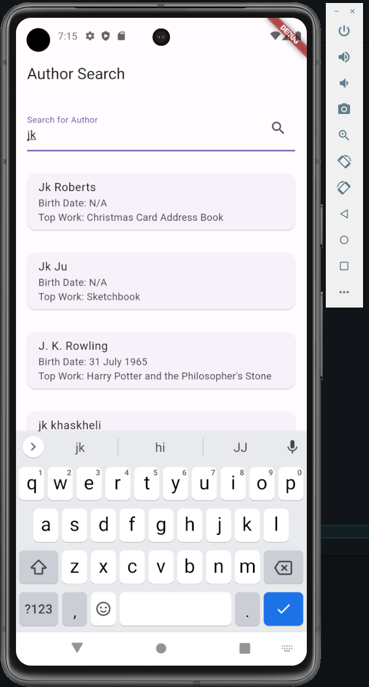
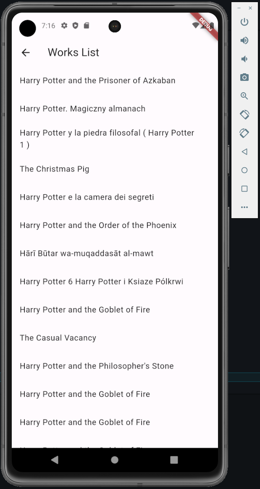

# AuthorSearch

AuthorSearch is a Flutter application that allows users to search for authors and explore their works.

## Screenshots




## Installation

Make sure you have Flutter installed on your machine. If not, follow the installation instructions for Flutter from [the official Flutter website](https://flutter.dev/docs/get-started/install).

1. Clone this repository to your machine.

   ```bash
   git clone https://github.com/ndium/authorsearch.git
   ```
   
2. Go in the repository AuthorSearch
   ```bash
   cd AuthorSearch
   ```

3. Install or update the dependencies
   ```bash
   flutter pub get
   ```

4. To build the Flutter project, use the following command
   ```bash
   flutter build apk
   ```

5. To run the Flutter project on an emulator or device, use the following command:
   ```bash
   flutter run
   ```
   
